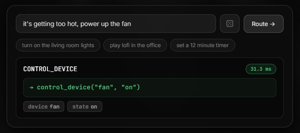

# NanoRouter

[]()
[]()

A schema-conditioned API function router. Fine-tune once on your schema, route any natural language query to the correct function and parameters.

Built on `all-MiniLM-L6-v2` (22 MB).



**[Live Demo Webpage](https://cenkozk.github.io/NanoRouter/)**


---

## Smart Home Benchmark

**32 hand-crafted natural language queries · 3 functions · 6 enum parameters**

Both models trained on identical data (45 programmatic examples). Evaluated on unseen natural language phrases.

| Model | Fn% | Latency | Train | Size |
|---|---|---|---|---|
| **NanoRouter (fine-tuned MiniLM)** | **93.8%** | **9.8 ms** | **17 s** | **22 MB** |
| FunctionGemma 270M (LoRA r=8) | 90.6% | 1,431 ms | 769 s | 537 MB |

**vs. FunctionGemma-270M (LoRA):**
- **146× faster inference** (1,431 ms → 9.8 ms)
- **46× faster to fine-tune** (769 s → 17 s)
- **24× smaller** (537 MB → 22 MB ONNX)

---

## Architecture

NanoRouter uses a **bi-encoder + MaxSim** architecture rather than classification or generation:

1. **Fine-tuned MiniLM** encodes the user query into token embeddings
2. **Pre-computed function embeddings** built from schema descriptions + causal value descriptors
3. **MaxSim** (ColBERT-style late interaction) computes alignment scores, the highest-scoring function wins
4. **Lexical tier** extracts enum values that appear verbatim; **semantic tier** handles implicit ones (e.g. "it's getting cold" → `state: off` via causal description anchors)


### Causal Descriptions

Instead of synonym lists, `value_descriptions` encode *circumstances*:

```json
"state": {
  "value_descriptions": {
    "on":  "turn on switch on start activate, too dark too hot stuffy need heat",
    "off": "turn off shut down kill close, too cold bothering me annoying drafty freezing"
  }
}
```

---

## Quick Start

### Install

```bash
pip install torch transformers peft onnxruntime
```

### Train on your schema

```bash
python router.py train --schema examples/smart_home.json --out smart_home.pt
```

Synthesizes diverse training queries automatically, uses Ollama if running, programmatic augmentation otherwise (zero external deps).

### Route a query

```bash
python router.py route --checkpoint smart_home.pt --query "its getting too cold in the living room"
# → CONTROL_DEVICE  state=off  room=living_room   (11.2 ms)
```

### Export for browser (ONNX)

```bash
python export_onnx.py --checkpoint smart_home.pt
# → nanorouter.onnx + nanorouter_routes.json
```

---

## Schema Format

```json
{
  "name": "smart_home",
  "functions": [
    {
      "name": "CONTROL_DEVICE",
      "description": "Turn a smart home device on or off.",
      "parameters": {
        "device": {
          "type": "enum",
          "lexical": true,
          "values": ["lights", "fan", "tv", "ac"],
          "value_descriptions": {
            "lights": "lights lighting lamp bulb ceiling light too dark dim",
            "fan":    "fan ventilation ceiling fan cold draft chilly"
          }
        },
        "state": {
          "type": "enum",
          "values": ["on", "off"],
          "value_descriptions": {
            "on":  "turn on switch on start activate — too dark too hot stuffy",
            "off": "turn off shut down kill close — too cold bothering drafty"
          }
        }
      }
    }
  ]
}
```

`"lexical": true` — param extracted by token matching (device names, room names). Omit for purely semantic params (state, sentiment, genre).

---

## Data Synthesis Tiers

| Priority | Source | Requirement |
|---|---|---|
| 1 | `--examples` file (hand-written) | 5–10 examples/fn |
| 2 | Ollama local LLM | `ollama serve` |
| 3 | Programmatic augmentation

Results cached per schema hash.

---

## Repository

```
router.py                    # Core: train / route / eval CLI
export_onnx.py               # Export fine-tuned checkpoint to ONNX
bench_smart_home.py          # Benchmark: NanoRouter vs FunctionGemma-270M (LoRA)
examples/smart_home.json     # Smart home schema with causal value descriptions
examples/test_smart_home.json# 32 hand-crafted natural language test queries
nanorouter.onnx              # Exported ONNX model (runs in browser)
nanorouter_routes.json       # Pre-computed schema embeddings for browser inference
smart_home.pt                # Fine-tuned PyTorch checkpoint
tokenizer.json               # MiniLM tokenizer (offline use)
```

## Requirements

```
torch>=2.0
transformers>=4.35
peft>=0.6        # bench_smart_home.py only
onnxruntime      # export_onnx.py only
```
